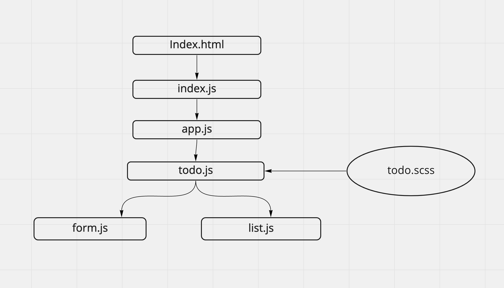

# todo

Author: Jessi Velazquez

PR: [https://github.com/JessiVelazquez/todo/pull/2](https://github.com/JessiVelazquez/todo/pull/2)

**Build 1.0.0**

This is a React application that features a form input for a user to input to-do list items and assign them to a specific person, and also assign a difficulty rating. The active list appears on the right side of the page and shows all of the active items in the list and who they are assigned to. Clicking on a list item will render it to "completed" state - updating the color and text styling of the list item and also updating the total number in list on both the app header and browser header. This application uses bootstrap styling.

## UML

