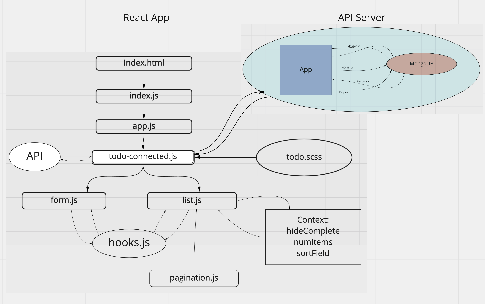

# todo

Author: Jessi Velazquez

*Heroku is charging me more than I thought to host, so I pulled down the deployment of this project. In the meantime, please clone and run locally instead:*

## How to Run This Project:
1. Copy the HTTPS or SSH string for this repository in the upper right here on Github.
2. Open terminal, run 'git clone <copied URL>.
3. Run 'npm install' to install dependencies.
4. Run 'npm run start', this should bring up the project locally at port 3000. If not, navigate to https://localhost:3000.

The back end of this project is the API I have built in this repo: [https://github.com/JessiVelazquez/api-server](https://github.com/JessiVelazquez/api-server). It is hosted at [https://api-server-jessi.herokuapp.com/store](https://api-server-jessi.herokuapp.com/store).

PR: [https://github.com/JessiVelazquez/todo/pull/15](https://github.com/JessiVelazquez/todo/pull/15)

## Overview and Description

This is a React application with a Node.js back end that utilizes a Mongo database to persist data. The function of this application is to facilitate a multi-user to-do list tracking system. On the front end, users can add new to-do items, which are stored with a task, assignee, and difficulty rating. Tasks can be updated or deleted, or marked completed (but not deleted). There is viewing functionality built in to hide the tasks that are marked as complete, or sort the task list by assignee, task (alphabetical), or difficulty rating. There is also pagination added to the list viewing pane, as well as a drop down menu that allows the user to determine how many tasks per page will be displayed.

## Build History

**Build 1.0.0**

This is a React application that features a form input for a user to input to-do list items and assign them to a specific person, and also assign a difficulty rating. The active list appears on the right side of the page and shows all of the active items in the list and who they are assigned to. Clicking on a list item will render it to "completed" state - updating the color and text styling of the list item and also updating the total number in list on both the app header and browser header. This application uses bootstrap styling.

**Build 1.2.0**

We have now added an update route and re-factored code to use custom React hooks. We have also connected our front end to the back end of api-server by adding custom routing for this to-do list front end to that server code.

**Build 2.1.0**

In this release, we have used React context to manage state globally, adding functionality for:

1. hiding completed tasks

2. sorting the task list by either assignee, task, or difficulty rating

3. Pagination for list display

4. Drop down for selecting how many tasks to display per page

We have also cleaned up the styling to look just like the Remo help queue!

**Build 2.1.1**

In this build, we have moved our database to its own designated Mongo Atlas project cluster. We have also added styling elements, and have made the following bug fixes and feature updates:

1. Case sensitive sorting has been fixed.

2. Default setting to 1 in the server side schema.

3. Added the ability to view all tasks on one page.

## UML

